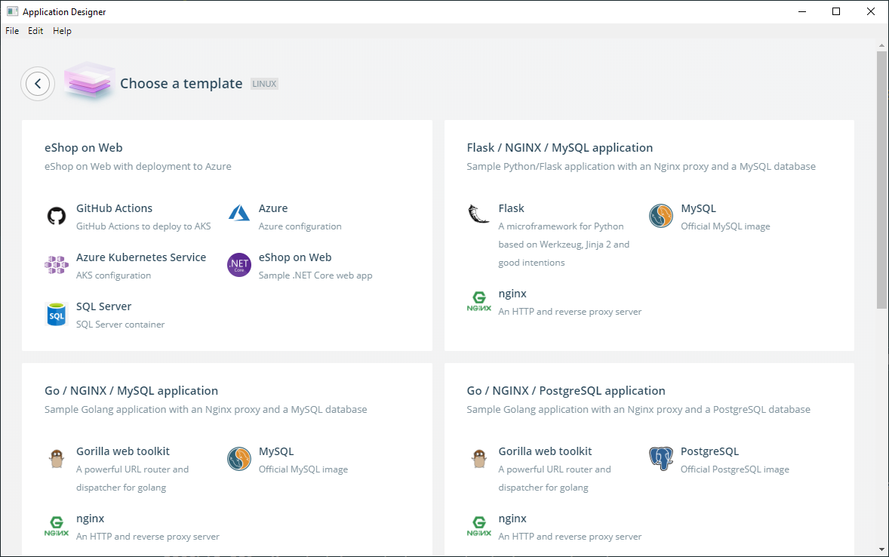
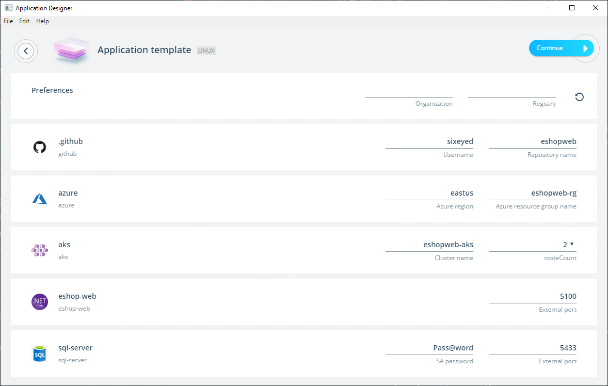
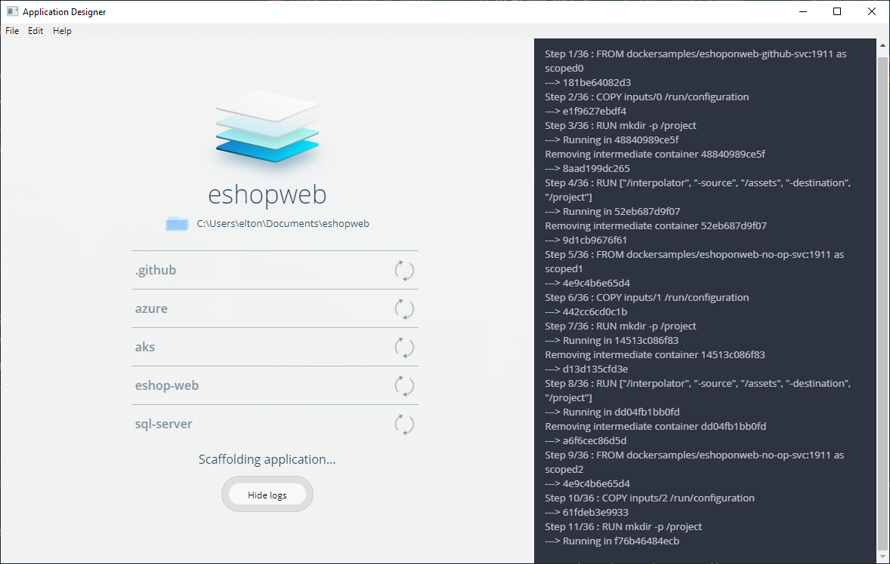

# eshoponweb-template

Docker Application Template for deploying [eShopOnWeb](TODO) onto Azure Kubernetes Service.

> Check out the video here:

<iframe width="560" height="315" src="https://www.youtube.com/embed/N4hKrl2NYSo" frameborder="0" allow="accelerometer; autoplay; encrypted-media; gyroscope; picture-in-picture" allowfullscreen></iframe>

## Pre-requisites

1. You need [Docker Desktop Enterprise](https://hub.docker.com/editions/community/docker-desktop-ent) which has the [Application Templates](https://blog.docker.com/2019/07/application-templates-docker-desktop-enterprise/) feature.

> The demo is a Linux app, so on Windows you need to use Linux container mode

2. You need a Docker Hub account, so the pipeline can push images.

> If you've set your account to create private repos on push, make sure you have capacity for another repo

3. Create a Service Principal in Azure. You can use the [Azure CLI](https://github.com/Azure/azure-cli) or [Azure Cloud Shell](https://shell.azure.com):

```
az ad sp create-for-rbac --name http://eshoponweb
```

> The output contains all the details you'll need to save as GitHub secrets

4. Your GitHub account needs to be approved for [GitHub Actions](https://help.github.com/en/articles/about-github-actions) (currently in beta). Then create an empty repo and set the following secrets (under _Settings...Secrets_):

- `AZURE_SP_APP_ID` - Service Principal application ID
- `AZURE_SP_NAME` - Service Principal name
- `AZURE_SP_PASSWORD` - Service Principal password
- `AZURE_SP_TENANT` - Service Principal tenant
- `AZURE_SQL_SERVER_NAME` - Name of the SQL Server instance
- `AZURE_SQL_PASSWORD` - Password for SQL Server
- `DOCKER_HUB_USERNAME` - Docker Hub username
- `DOCKER_HUB_ACCESS_TOKEN` - Docker Hub [Personal Access Token](https://www.docker.com/blog/docker-hub-new-personal-access-tokens/)

## Setup

Update your Docker Application Template config in `~/.docker/application-template/preferences.yaml` to include the template library at `https://raw.githubusercontent.com/dockersamples/eshoponweb-template/master/eshoponweb-library.yaml`.

This example includes the local demo libraries and the main Docker library:

```
apiVersion: v1alpha1
disableFeedback: false
kind: Preferences
repositories:
- name: eshoponweb-library
  url: https://raw.githubusercontent.com/dockersamples/eshoponweb-template/master/eshoponweb-library.yaml
- name: library
  url: https://docker-application-template.s3.amazonaws.com/production/v0.1.5/library.yaml
```

## Usage

- Run Application Designer (open the Docker whale menu from the taskbar and click _Design new application..._)

- Select _New Application..._ _Choose a template_ (if you're running on Windows 10 select _Linux_) You should see the eShop on Web app listed with all the standard templates:



- Select the template and add the settings for your application:



- You need to provide:

    * Your GitHub username and the name of the repository to use. **This needs to be the GitHub repo you created with your secrets.**

    * The name for your Azure resource group. The deployment will create this group if it doesn't exist, so you can use any name.

    * The name for your AKS cluster. This gets created for you so you can use any name.

- Click _Continue_, give your app a name and click _Scaffold_:



- Click _Run Application_. Docker Desktop Enterprise will build and run the app locally:


- Click _Open in Visual Studio Code_ to see the source code the template generated.

> Now browse to the `README.md` doc in the `eshop-web` folder to see how to deploy the app to Azure.

## Teardown

Delete the resource group you created.

Delete the Service Principal:

```
az ad sp delete --id http://eshoponweb
```

### Credits

The demo app is a modified version of [eShopOnWeb](https://github.com/dotnet-architecture/eShopOnWeb).
